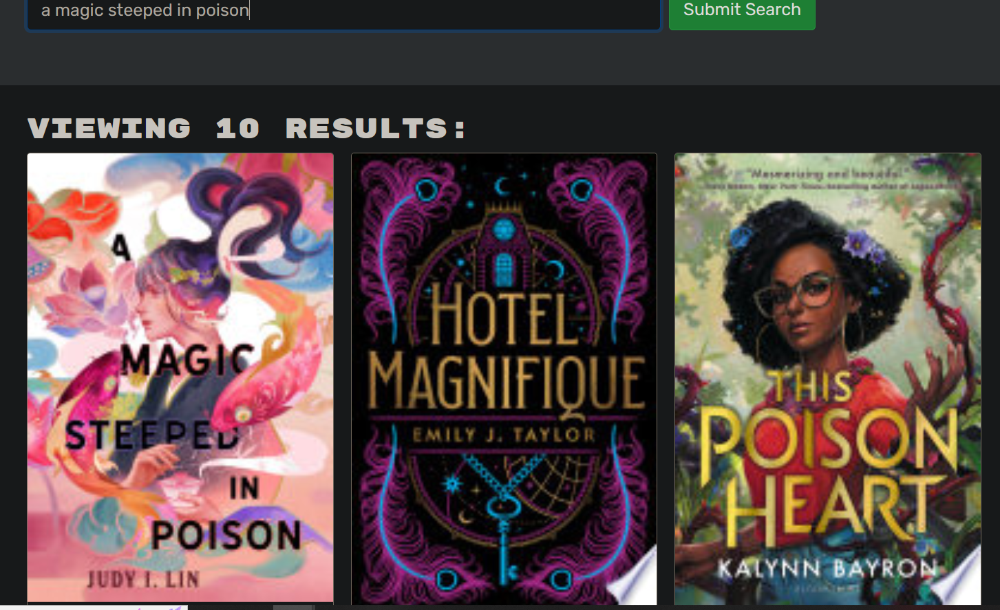
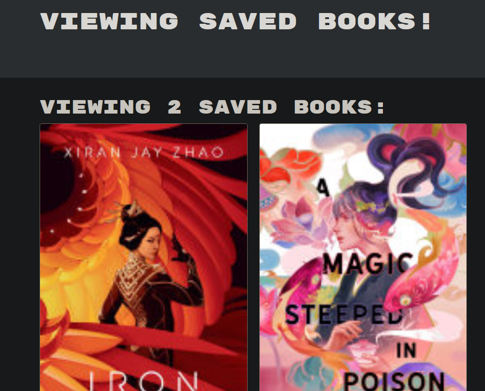

# Book Search Engine Built With MERN

## Description
In this modern age, web applications continuously contend with two major factors: data and user demand. As time progresses and user demands change and sometimes grow more complex, the tools applications use to meet that demand must also evolve. This project is a book search engine using an existing Google Books API that utilizes and showcases the following:

The MERN Stack is one of the most popular architectural structures for web development in the modern age, being a general combination of MongoDB, Express.js, React, and Node.js used to build full stack applications, with some small existing variations. 

More importantly, this project utilizes GraphQL, a relatively newer query and manipulation language for APIs that is often contrasted to RESTful API. Compared to the latter, given a database without many complex relationships, GraphQL allows developers to write queries that return multiple points of data of their choice, compared to RESTful which is limited to typically one set of data per request. This often makes it the more optimal choice when it comes to more layered user demands. 

Originally an application that used RESTful for its requests, this assignment's goal is to refactor it into using GraphQL requests. 

### Technology
- MongoDB
- Express.js
- React
- Node.js
- GraphQL
    - Apollo Server
- JSON web tokens (JWT)

## Installation Instructions
```
npm i
```

## Usage Instructions
On the deployed app, make sure to first create an account if you have not already done so. Once you are logged in, search for a book in the provided search bar. A list of results will appear below that includes an image of the book's cover as well as a description below. At the bottom of the description, if you are logged in, there will be a button that allows a user to add that book to a list of their saved books. If the book is already saved, the button will tell you so. 

To view your list of saved books, click the "See Your Books" link on the top right of the page. Here you can delete books from the list. 

[Click here for the deployed app.](https://book-search-engine-mern-rd.herokuapp.com/)

### Screenshots





## License
This project is MIT licensed.

## Contact
- [GitHub](https://github.com/reversedentistry)
- Email: sherylhu@proton.me